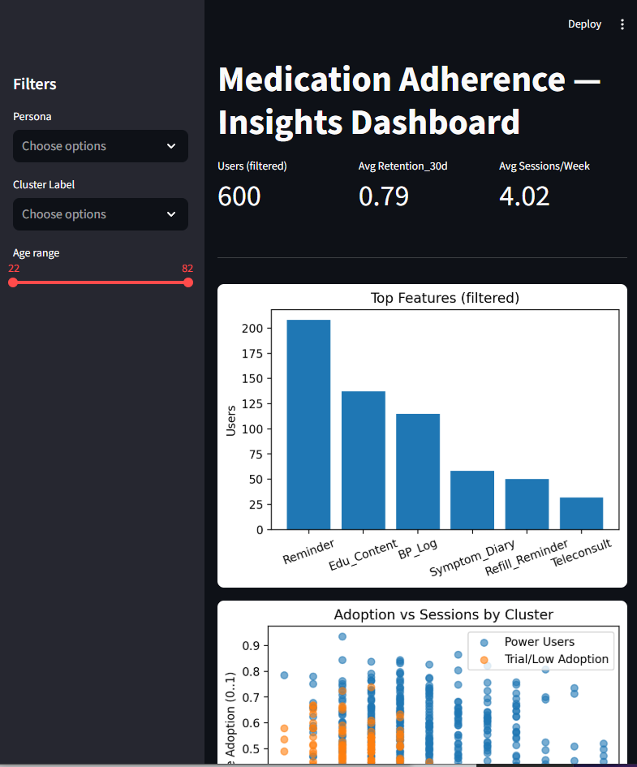
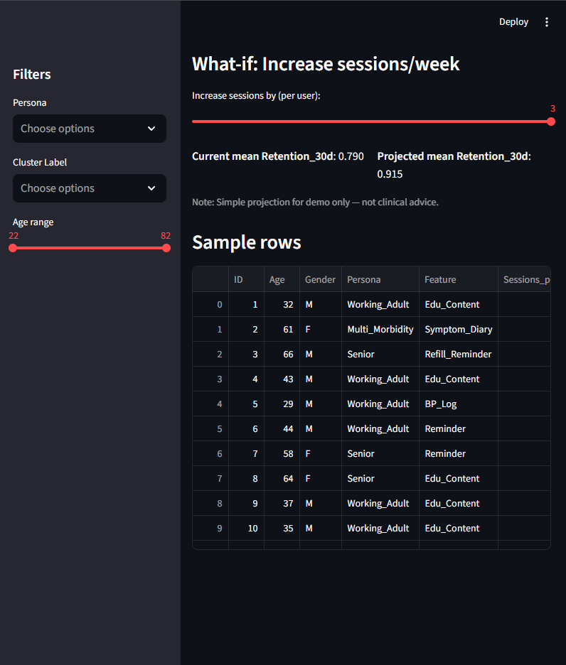

# Medication Adherence — R&D Mini-Portfolio (Le Bao Khuyen, B.Pharm)

Three hiring-ready deliverables:
1) **PRD & Market Research (1–2 pages)** — `docs/PRD_onepager.pdf`  
2) **User Behavior Analysis & Segmentation** (EDA + KMeans) — charts + `report/cluster_summary.csv`  
3) **Interactive Insights Prototype (Streamlit)** — KPI dashboard with a “what-if” simulation

> Privacy-first. Synthetic data for portfolio purposes. Not medical advice.

---

## Quick start (Windows, E:)
```cmd
cd /d E:\projects\medication_adherence_rnd_capstone
venv\Scripts\activate
python -m pip install --upgrade pip
pip install pandas numpy scikit-learn matplotlib streamlit
python src\create_data.py
python src\analysis.py
python -m streamlit run app\app.py --server.port 8502
---

## Screenshots

  

